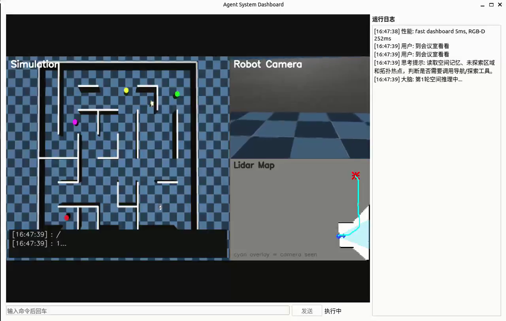

# MuJoCo 人形机器人分层导航智能体

这是一个基于 MuJoCo 的机器人导航项目。系统把低层运动控制、SAC 局部导航、Frontier 未知区域探索、RGB-D 地标感知、空间记忆、拓扑地点识别和语言指令接口串在一起，让机器人在随机室内地图中探索、记录地标，并根据用户指令执行导航任务。

项目重点不是单独训练一个策略，而是把“能走”“能看”“能记”“能规划”和“能响应自然语言任务”组织成一个可运行的交互式系统。运行后会打开 Qt dashboard，展示相机画面、栅格地图、任务日志和命令输入。

## 演示视频

[](https://cdn.jsdelivr.net/gh/BigWhiteCPN/mujoco-humanoid-hierarchical-rl-llm-spatial-navigation@main/assets/demo.mp4)

[观看 2 分 45 秒演示视频](https://cdn.jsdelivr.net/gh/BigWhiteCPN/mujoco-humanoid-hierarchical-rl-llm-spatial-navigation@main/assets/demo.mp4)（[WebM 备用链接](https://cdn.jsdelivr.net/gh/BigWhiteCPN/mujoco-humanoid-hierarchical-rl-llm-spatial-navigation@main/assets/demo.webm)）。

## 技术要点

- 分层控制：低层 locomotion policy 负责机器人运动稳定性，上层 SAC policy 负责局部导航决策。
- 在线建图：通过 lidar 更新 occupancy grid，并用 Frontier 策略选择下一批未知区域。
- 语义地标记忆：RGB-D 观测到地标后，融合多次观测结果，记录语义标签和估计坐标。
- 拓扑地点识别：从局部占据图中提取 fingerprint，用于识别重复访问的位置和关键路口。
- 路径预演：执行导航前先用当前地图做可达性检查，避免直接把机器人推向明显不可达目标。
- 实时交互：等待语言模型响应时，机器人仍会保持 idle locomotion、更新感知并刷新 dashboard。
- 记忆持久化：空间记忆、拓扑地图、访问栅格和里程计日志可以保存并在后续 session 中加载。

## 系统流程

```text
用户指令
    |
    v
RobotAgent
    |-- 读取空间记忆和未探索区域
    |-- 通过 OpenAI 兼容接口选择工具
    |-- 使用 MentalSimulator 做路径可达性检查
    |
    v
Skills
    |-- FrontierExplorationSkill: 选择并访问 frontier
    |-- NavigationSkill: 调用 SAC policy 执行局部导航
    |-- PerceptionSkill: 更新地标检测和空间记忆
    |
    v
AgentVisualEnv / MuJoCo
    |-- 机器人动力学和传感器
    |-- lidar occupancy grid
    |-- RGB-D 地标观测
    |
    v
SpatialMemory + TopologicalMap + Qt dashboard
```

## 项目结构

```text
.
├── main.py                         # 项目入口、CLI 参数和运行配置
├── agent_env.py                    # MuJoCo 环境封装、感知更新、dashboard hook
├── skills.py                       # 导航、探索、感知等技能
├── llm_brain.py                    # 语言指令解析和工具调用
├── memory.py                       # 空间记忆和拓扑地图
├── realtime_runner.py              # 空闲运动、感知和渲染调度
├── qt_dashboard.py                 # Qt dashboard
├── resources/                      # MuJoCo XML 和 mesh
├── models/                         # 低层运动策略和 SAC 导航策略
├── visual_train/                   # 与导航策略匹配的随机地图环境
├── scripts/check_demo_assets.py    # 运行前资产检查
└── tests/                          # 不启动 MuJoCo 的轻量测试
```

## 运行环境

- Python 3.10
- Linux 桌面或工作站环境
- MuJoCo 可用的 OpenGL 后端，默认使用 `MUJOCO_GL=egl`
- 建议使用 GPU 运行 Torch 策略推理和 dashboard 渲染
- 自然语言指令需要一个 OpenAI 兼容的 chat endpoint；不用语言接口时可以通过 `--no-llm` 运行

安装运行依赖：

```bash
python -m pip install -r requirements.txt
```

安装测试和本地检查依赖：

```bash
python -m pip install -r requirements-dev.txt
```

## 配置

复制配置模板：

```bash
cp .env.example .env
```

如果需要使用自然语言指令，在 `.env` 中设置 API key：

```bash
SILICONFLOW_API_KEY=your_api_key_here
```

默认使用 SiliconFlow 的 OpenAI 兼容接口，也可以替换为其他兼容服务：

```bash
LLM_BASE_URL=https://api.siliconflow.cn/v1
LLM_MODEL=Pro/zai-org/GLM-4.7
```

默认运行资产已经随仓库提供：

```bash
ROBOT_MODEL_XML=resources/mjcf/Linnxil_fifteen_angle_bs_copy_20260302_copy.xml
LOW_LEVEL_POLICY_PATH=models/policy_20251026.pt
SAC_MODEL_PATH=models/sac_lidar_interrupted_good3_0.91.zip
```

## 启动

启动交互式 dashboard：

```bash
python main.py
```

常用运行方式：

```bash
python main.py --no-llm
python main.py --debug-timing --log-level DEBUG
python main.py --render-mode rgb_array
python main.py --show-landmark-debug
```

常用配置也可以直接写进 `.env`：`RENDER_MODE`、`DEBUG_TIMING`、`MEMORY_DIR`、`MUJOCO_GL`、`LLM_BASE_URL`、`LLM_MODEL`。

## 启动后可以尝试

在 dashboard 输入框或终端中输入：

```text
去会议室看看
你发现了什么
回忆一下
保存记忆
加载记忆
重置地图
退出
```

其中 `保存记忆`、`加载记忆`、`回忆`、`重置地图`、`退出` 是本地命令，不依赖语言模型接口。其它自然语言任务会进入 `RobotAgent`，由工具调用完成探索、路径预演和导航。

## 运行前检查

检查项目需要的模型和资源文件是否存在：

```bash
python scripts/check_demo_assets.py
```

运行轻量测试：

```bash
pytest
```

当前测试覆盖配置解析、资产检查、空间记忆保存/加载、访问地图融合和拓扑地点匹配。这些测试不会启动 MuJoCo，适合在普通开发环境中快速验证仓库状态。

## 已知限制

- 当前策略权重和随机地图环境是配套的，直接替换机器人 XML 或观测格式可能需要重新训练策略。
- 自然语言任务依赖网络和服务端响应；无 key 或离线环境下请使用 `--no-llm`。
- 语义分割模块只有在相关路径启用时才会下载并加载模型权重。
- dashboard 主要面向本地交互运行，没有按 headless 批量评测场景做完整封装。
- `memory_logs/` 是运行时输出，默认不提交到 git。

## 资产说明

仓库中包含运行本项目所需的 MuJoCo XML、mesh、策略权重和视频素材。具体清单见 [ASSETS.md](ASSETS.md)。
